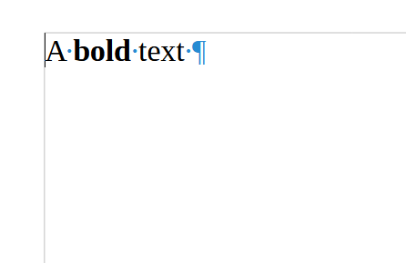
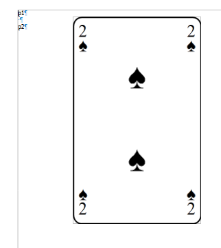
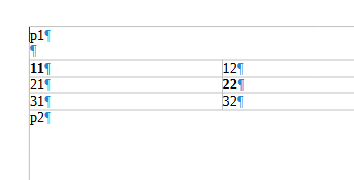
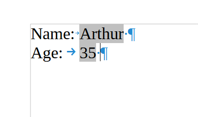
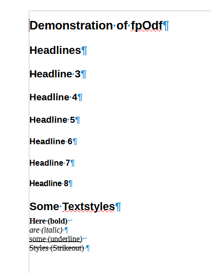
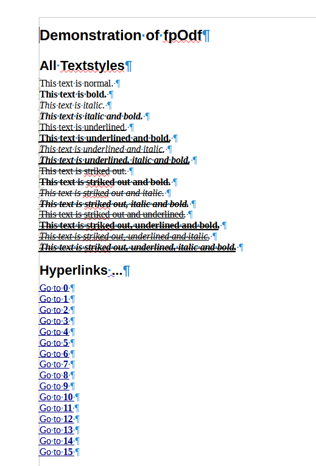
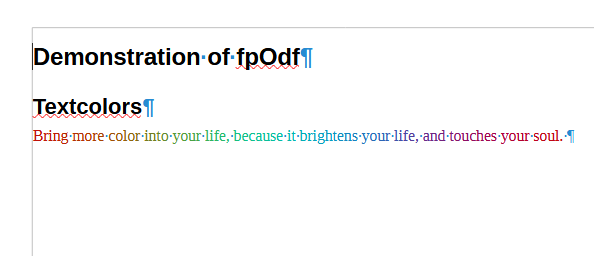

# Examples for fpOdf

## HelloWorld
Simply writes "Hello world" in a document.
```pascal
with TOdfTextDocument.Create do
  begin
      AddParagraph(cStyleName).TextContent:='Hello World!';
      SaveToZipFile(cOutput);
      Free;
  end;
```
## BoldText
Does some simple highlighting<br />
<br />
[[BoldText.fodt]](../Resources/BoldText.fodt)
```pascal
p:=AddParagraph(cParagraphStyle);
p.TextContent:='A ';
p.AddSpan('bold', [fsBold]);
p.AddSpan(' text', []);  
```

## InsertImage
Example how to insert an image to the document<br />
<br />
[[ShowImage.fodt]](../Resources/output.fodt)
```pascal
p:=doc.AddParagraph(cStyle);
eDrawFrame:=p.AppendOdfElement(oetDrawFrame);
eDrawFrame.SetAttributes(
   [oatDrawStyleName, oatDrawName, oatTextAnchorType, oatSvgWidth, oatSvgHeight, oatDrawZIndex],
   ['fr1', 'Image1', 'paragraph', '3.60in', '5.8in', '0']);
eDrawImage:=eDrawFrame.AppendOdfElement(oetDrawImage);
eBinaryData:=eDrawImage.AppendOdfElement(oetOfficeBinaryData);
fs := TFilestream.Create("SomeImage.png",fmOpenRead); 
eBinaryData.TextContent:=EncodeStreamBase64(fs);
```
## TableInsert
<br />
[[ShowTable.fodt]](../Resources/ShowTable.fodt)
```pascal
p:=doc.AddParagraph(cStyle);

//Create Table
vTable:=doc.CreateOdfElement(oetTableTable);
vTable.SetAttributes([oatTableName, oatTableStyleName], ['Table1', cTableStyle]);

//Create table column description.
e:=vTable.AppendOdfElement(oetTableTableColumn, oatTableStyleName, cTableColumnStyle);
e.SetAttribute(oatTableNumberColumnsRepeated, IntToStr(cColCount));

//create rows and cells
for i:=1 to cRowCount do
begin
    vRow:=vTable.AppendOdfElement(oetTableTableRow);

    for j:=1 to cColCount do
    begin
         vCell:=vRow.AppendOdfElement(oetTableTableCell, oatTableStyleName, cTableCellStyle);
         vCell.SetAttribute(oatOfficeValueType, 'string');

         if i=j
         then
             s:=cTableCellStyle2
         else
             s:=cStyle;

         t:=Format('%d%d', [i,j]);
         vCell.AppendOdfElement(oetTextP, oatTextStyleName, s).TextContent:=t;
    end;
end;

doc.Text.AppendChild(vTable);
```
## SearchAndReplace
<br />
[[ReplaceFieldsExample.fodt]](../Resources/ReplaceFieldsExample.fodt)

## Improved Demo
Demo to really show of the capability of fpOdf
[[AllParts.pdf]](../Resources/AllParts.pdf)

### Styles
some styles like "Headings" "normal Text"<br/>
<br />
[[ShowStyles.fodt]](../Resources/ShowStyles.fodt)
```pascal
FOdfTextDocument.AddHeadline(2).AppendText('Headlines');
for i := 3 to 8 do
    FOdfTextDocument.AddHeadline(i).AppendText('Headline ' + IntToStr(i));
FOdfTextDocument.AddHeadline(2).AppendText('Some Textstyles');
lPara := FOdfTextDocument.AddParagraph(cStyleName);
lpara.AddSpan('Here (bold)', [fsBold]);
lpara.AddLineBreak;
lpara.AddSpan('are (italic)', [fsItalic]);
lPara := FOdfTextDocument.AddParagraph(cStyleName);
lpara.AddSpan('some (underline)', [fsUnderline]);
lpara.AddLineBreak;
lpara.AddSpan('Styles (Strikeout)', [fsStrikeOut]);
```
### Links
some links and destinations<br/>
<br />
[[ShowLinks.fodt]](../Resources/ShowLinks.fodt)

### Color
some links and destinations<br/>
<br />
[[ShowColor.fodt]](../Resources/ShowColor.fodt)
```pascal
lText := 'Bring more color into your documents, because it brightens your life, and touches your soul.';
lPara := FOdfTextDocument.AddParagraph(cStyleName);
aFont := TFont.Create;
aFont.Name := 'default';
try
  i := 1;
  while i <= length(lText) do
    begin
      w := i / length(lText) * pi * 2;
      afont.Color :=
          RGBToColor(96 + trunc(cos(w) * 96), 96 +
          trunc(sin(w - pi / 3) * 96), 96 + trunc(sin(w + 4 * pi / 3) * 96));
      if lText[i] <> 'ü'[1] then // basic utf-8 decoding
          lpara.AddSpan(lText[i], aFont, FOdfTextDocument)
      else
        begin
          lpara.AddSpan(copy(lText, i, 2), aFont, FOdfTextDocument);
          Inc(i);
        end;
      Inc(i);
    end;
finally;
  FreeAndNil(aFont)
end;  
```
### Tabs
insert tabs for formating<br/>
[[ShowTabs.fodt]](../Resources/ShowTabs.fodt)

### Fonts
Use various fonts<br/>
see [[AllParts.pdf]](../Resources/AllParts.pdf)
```pascal
aFont := TFont.Create;
try
  for lFont in Screen.Fonts do
    begin
      if copy(lfont, 1, 1) <> lFirstChar then
        begin
          FOdfTextDocument.AddHeadline(4).AppendText(copy(lfont, 1, 1));
          lFirstChar := copy(lfont, 1, 1);
        end;
      lPara := FOdfTextDocument.AddParagraph(cStyleName);
      aFont.Name := lFont;
      lpara.AddSpan('This is Font: "' + lFont + '"', []);
      lPara.AddLineBreak;
      lSpan := lpara.AddSpan('ABCDEF abcdef 12345', aFont, FOdfTextDocument);
      lSpan.AddLineBreak;
      lSpan.AppendText('The quick, brown fox jumps over the lazy dog.');
      lSpan.AddLineBreak;
    end;
finally
  FreeAndNil(aFont)
end;
```
# Another example (in german & without code)
Links, table, columns, footer, headlines, fonts, enumerations, extended charset ...
(automatically generated from a [GEDCOM](http://github.com/search?q=gedcom&type=repositories)-file)<br/>
[[Demo Familybook (Muster)]](../Resources/Muster_GEDCOM_UTF-8.pdf)
